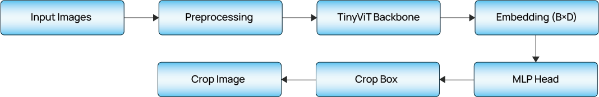
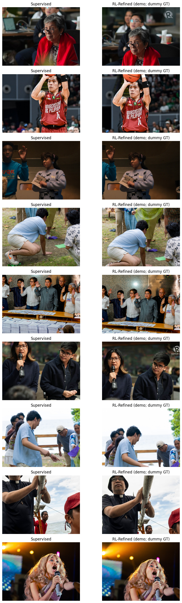

## Smart Aesthetic Image Cropper for People-Centered Photographs (EfficientNet + RL)
**CSC173 Intelligent Systems Final Project**  
*Mindanao State University - Iligan Institute of Technology*  
**Student:** KRISTOFFER NEO V. SENYAHAN, 2022-4762   
**Semester:** AY 2025-2026 Semester 1  

## Abstract
This project presents a ***two-stage deep computer vision system*** for automatically generating aesthetically pleasing crops of people-centered photographs. *Traditional automatic croppers typically rely on simple bounding boxes or fixed heuristics*, which often result in rigid, poorly framed outputs that lack visual appeal. To address this limitation, the proposed system combines `supervised learning` and `reinforcement learning` to better approximate human-like cropping decisions.

The system follows a two-stage pipeline. First, a lightweight Convolutional Neural Network (EfficientNet-B0) is trained in a supervised manner to predict an initial human-centered crop. Second, a compact reinforcement learning (RL) agent refines this initial crop through intuitive photographer-like actions such as panning, zooming, and stopping. This refinement stage allows the model to make fine-grained adjustments that are difficult to capture using supervised learning alone.

Training data is sourced from the **Open Images V7 dataset (Person class)**, where annotated bounding boxes are treated as proxy aesthetic crop targets. While these annotations are not explicitly aesthetic, they provide a strong baseline for subject-centered composition. Experimental results show that the supervised EfficientNet-B0 model learns stable and reliable initial crops, and that RL refinement further improves framing quality, headroom, and subject centering in many cases. Qualitative comparisons with crops produced by campus photojournalists suggest that the refined outputs often align with professional framing preferences.

Overall, this work demonstrates a feasible and lightweight approach to aesthetic image cropping by combining modern deep vision models with reinforcement learning for improved composition control.

## Table of Contents

## Introduction
### Problem Statement
People-centered images are fundamental in photojournalism, news media, and digital publications. However, raw images often require manual cropping to highlight the subject, maintain proper framing, and produce visually appealing thumbnails. Automating this process is challenging because effective cropping goes beyond object detection—it involves aesthetic judgment, balance, and composition.

Most existing automatic cropping systems focus on localization accuracy rather than visual quality, leading to crops that are technically correct but visually unrefined. This project addresses that gap by designing an intelligent cropper that produces clean, professional, and human-centered crops without manual intervention.

### Objectives
The objectives of this project are to:

- Train a convolutional neural network (EfficientNet-B0) to predict an initial human-centered crop.
- Design and train a lightweight reinforcement learning agent to refine crops using pan, zoom, and stop actions.
- Compare model-generated crops with those produced by campus photojournalists through qualitative analysis.
- Evaluate the system using both quantitative metrics and visual inspection.

### Related Works

- **Lightweight convolutional neural networks** such as EfficientNet have demonstrated strong performance in image representation and localization tasks while remaining computationally efficient.
- **Aesthetic image cropping** has traditionally relied on convolutional models and handcrafted heuristics, with relatively limited integration of reinforcement learning for fine-grained refinement.
- **Reinforcement learning for cropping:** While RL has been explored in prior image cropping studies, most approaches focus on generic object-centric scenarios rather than portrait-oriented or human-centered images.
- **Our contribution:** This project contributes a hybrid approach that combines a supervised EfficientNet-based crop predictor with a reinforcement learning refinement stage, evaluated using both quantitative overlap metrics and human-aligned qualitative comparisons.

### Limitations

While the proposed system demonstrates promising results, it is not a perfect solution and remains inherently dependent on its training data. The supervised stage relies on person bounding boxes from the Open Images dataset, which are treated as proxy aesthetic crop targets. As a result, the model’s notion of a “good” crop is constrained by the distribution, quality, and biases of the training annotations and may not generalize equally well to all photographic styles or contexts.

Additionally, the reinforcement learning agent is trained using handcrafted reward components and operates within a limited discrete action space. Although this design improves stability and interpretability, it may restrict the range of compositional adjustments achievable compared to more expressive continuous-action policies.

Finally, qualitative evaluation against campus photojournalists is informal and limited in scale. While it provides useful human-aligned insight, it does not constitute a controlled or statistically rigorous user study.

## Methodology
### Dataset

- **Source:** Open Images V7 (Person class only)
- **Filtering Criteria:**
    - Images containing exactly one annotated person
    - Removes ambiguity and multi-subject framing
- **Ground-Truth Crop Generation:**
    - Person bounding boxes converted to crop targets
    - Bounding boxes optionally expanded by ~10–15% margin to include contextual headroom
    - All crop coordinates normalized to `[0,1]`
- **Dataset Split:**
    - Training / Validation / Test = 70% / 15% / 15%
    - Fixed random seed used for reproducibility

## Architecture
### Supervised Architecture: Smart Image Cropper

Figure 1 illustrates the overall architecture of the supervised crop prediction module. The model takes a single RGB image as input and outputs a normalized human-centered crop, which serves as the initial proposal for reinforcement learning refinement.

   

 The supervised model first processes a photo by resizing it in a way that preserves the original image shape and normalizing it so the system can analyze different images consistently. An EfficientNet-B0 network then examines the image to identify where the person is located and how they are framed. Based on this understanding, the model predicts a crop by estimating the center and size of the region that best highlights the person. These predictions are constrained to avoid invalid or extreme crops. The resulting output serves as a reasonable, human-centered crop that can be further refined.   

From a technical perspective, the architecture consists of an EfficientNet-B0 backbone operating on letterbox-resized, ImageNet-normalized inputs, followed by global average pooling and a lightweight regression head that predicts normalized crop parameters *(xc, yc, w, h).* Training uses a combination of Smooth L1 and IoU-based losses to balance regression stability and spatial alignment. The predicted crop provides a robust initialization for the subsequent reinforcement learning refinement stage.   

Together, this supervised design establishes a stable and interpretable baseline that enables the reinforcement learning agent to focus on fine-grained aesthetic adjustments rather than coarse localization.

### Reinforcement Learning Crop Refinement Module

Figure 2 illustrates the overall architecture of the reinforcement learning (RL) crop refinement module. The RL agent takes an initial human-centered crop produced by the supervised model and iteratively refines it through a sequence of photographer-like actions, ultimately producing a final aesthetically adjusted crop.

   

  The reinforcement learning process begins with an initial crop proposal generated by the supervised model. This crop is placed inside a custom cropping environment, which extracts the current image region and enforces valid crop constraints such as image boundaries and aspect ratio. At each step, the RL agent observes the current cropped image patch along with its normalized crop parameters and selects an action from a discrete set, including panning, zooming, or stopping. These actions incrementally adjust the crop in a manner similar to how a human photographer would fine-tune framing. Once a stop action is selected or a maximum number of steps is reached, the refinement process terminates and the final cropped image is produced.

From a technical perspective, the RL component is implemented as a lightweight convolutional policy network that processes a resized crop patch together with the current crop coordinates. Visual features extracted by the convolutional layers are concatenated with the crop parameters and passed through a fully connected layer to produce action logits over the discrete action space. The agent is trained using a policy-gradient (REINFORCE) algorithm with a shaped reward function that encourages improvements in Intersection-over-Union (IoU), subject containment, headroom, and compositional balance, while penalizing subject cuts and extreme aspect ratios. A moving-average baseline and gradient clipping are applied to stabilize training.

Together, this reinforcement learning design enables fine-grained, human-like crop adjustments on top of a reliable supervised initialization, allowing the system to move beyond coarse localization and produce more visually balanced and aesthetically pleasing image crops.

## Training Configuration

### 1. **EfficientNet-B0 – Supervised Cropper**

| Component               | Configuration / Description                                                           |
| ----------------------- | ------------------------------------------------------------------------------------- |
| **Backbone**            | EfficientNet-B0 (ImageNet-pretrained)                                                 |
| **Input Resolution**    | 224 × 224 (letterbox-resized, aspect ratio preserved)                                 |
| **Input Normalization** | ImageNet mean and standard deviation                                                  |
| **Feature Extraction**  | Convolutional encoder with compound scaling                                           |
| **Pooling**             | Global Average Pooling                                                                |
| **Prediction Head**     | Lightweight regression head                                                           |
| **Output Parameters**   | Normalized crop coordinates *(xcenter, ycenter, width, height)* |
| **Output Constraints**  | Clamped to valid bounds with minimum width and height                                 |
| **Loss Functions**      | Smooth L1 Loss (regression stability) IoU-based Loss (spatial alignment)           |
| **Training Objective**  | Learn a stable, human-centered initial crop                                           |
| **Role in Pipeline**    | Provides initialization for RL-based crop refinement                                  |
| **Optimizer**           | AdamW                                                                                 |
| **Learning Rate**       | `1e-4` (stable fine-tuning of pretrained backbone)                                    |
| **Training Epochs**     | 15 epochs (≈ 1–2 hours total training time)                                           |

### 2. **Mini Reinforcement Learning Agent – Crop Refinement**

| Component                  | Configuration / Description                                                                                                                                |
| -------------------------- | ---------------------------------------------------------------------------------------------------------------------------------------------------------- |
| **Environment**            | Custom cropping environment initialized from supervised crop predictions                                                                                   |
| **State Representation**   | Cropped RGB image patch resized to 96 × 96 Normalized crop parameters *(xcenter, ycenter, width, height)*                         |
| **Action Space**           | Discrete actions: pan left / right / up / down, zoom in, zoom out, stop                                                                                    |
| **Policy Network**         | Lightweight CNN for visual feature extraction Global pooling with concatenation of crop coordinates Fully connected layer producing action logits    |
| **RL Algorithm**           | Policy Gradient (REINFORCE)                                                                                                                                |
| **Reward Function**        | IoU improvement (primary shaping signal) Subject containment and edge-cut penalties Headroom and rule-of-thirds heuristics Aspect ratio stability |
| **Episode Termination**    | Stop action selected Maximum step limit reached Severe crop degradation detected                                                                     |
| **Optimizer**              | Adam                                                                                                                                                       |
| **Learning Rate**          | `1e-3` (higher rate for small policy network and noisy gradients)                                                                                          |
| **Training Episodes**      | 1000 episodes                                                                                                                                              |
| **Training Stabilization** | Discounted returns with baseline normalization Gradient clipping                                                                                        |
| **Training Objective**     | Incrementally refine supervised crops to improve aesthetic composition                                                                                     |

## SL + RL Execution Results and Discussion

Shown in the figure 3 below illustrates qualitative results produced by the proposed supervised learning (SL) and reinforcement learning (RL) pipeline when applied to previously unseen and unlabeled images. For each example, the left image shows the crop generated by the supervised model alone, while the right image shows the corresponding crop after reinforcement learning refinement. These examples are included to demonstrate how the two-stage system behaves in real-world scenarios where explicit ground-truth crop annotations are unavailable.

   

Even without ground-truth supervision, the supervised model consistently produces reasonable, human-centered initial crops. This indicates that the model has learned stable spatial priors for person localization and framing, successfully capturing the primary subject in most cases. These initial predictions provide a strong and reliable baseline that is suitable for further refinement by the reinforcement learning stage.

Building on this baseline, the reinforcement learning agent introduces subtle but meaningful improvements to crop composition. Across multiple examples, RL-refined crops show improved headroom, better subject centering, and reduced truncation, particularly in portrait-oriented and dynamic scenes. The agent often adjusts crop boundaries in a manner similar to photographer intuition, such as relaxing overly tight framing or re-centering subjects within the image. Although the refinement process is guided by a proxy reward function and uses a dummy reference during this demonstration, the visual improvements suggest that the learned policy generalizes beyond the training distribution. Overall, these results demonstrate that combining supervised crop prediction with reinforcement learning refinement produces more balanced and aesthetically pleasing crops than supervised learning alone when applied to unlabeled real-world images.

## Video Presentation

[Watch the video presentation. **Click Here**.](https://youtu.be/qbL7i-UkvXc)
